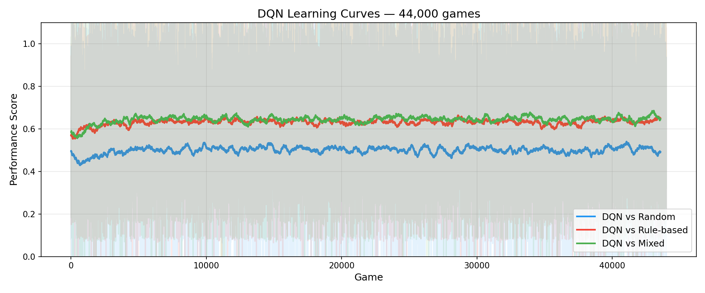
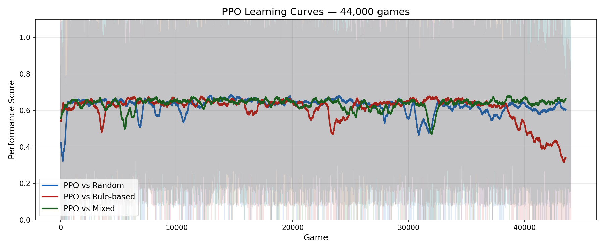
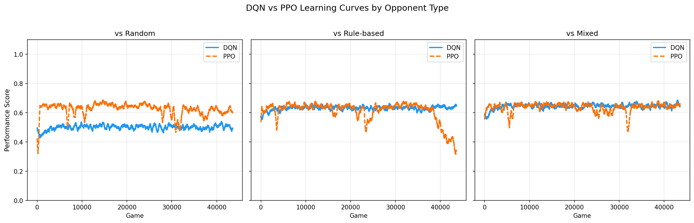
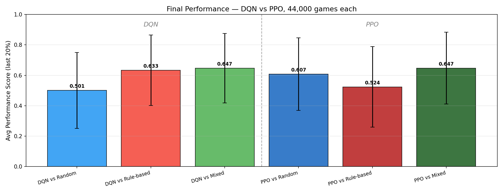

# Chef's Hat Gym — Opponent Modelling with DQN and PPO
**Coventry University | 7043SCN | Task 2 | Variant 0: Opponent Modelling** 

**Student ID: 12224702**

**Author: Mohamed Bseikri**

## Overview
This project investigates opponent modelling in the [Chef's Hat card game](https://github.com/pablovin/ChefsHatGYM) by training reinforcement learning agents against different opponent types and measuring the impact on learned policy quality.

Two RL algorithms are compared:

- DQN (Deep Q-Network) — value-based, off-policy
- PPO (Proximal Policy Optimisation) — policy gradient, on-policy

Each algorithm is trained under three opponent conditions (6 experiments in total), all for 44,000 games to ensure a fair comparison.

## Experiments & Results

| Exp | Algorithm | Opponent Type | Games | Avg Perf | Final 20% | Best |
|---|---|---|---|---|---|---|
| exp1 | DQN | vs Random     | 44,000 | 0.4997 | 0.5007 | 1.4781 |
| exp2 | DQN | vs Rule-based | 57,000 | 0.6322 | 0.6374 | 1.4832 |
| exp3 | DQN | vs Mixed      | 52,000 | 0.6446 | 0.6510 | 1.4742 |
| exp4 | PPO | vs Random     | 44,000 | 0.6228 | 0.6071 | 1.5015 |
| exp5 | PPO | vs Rule-based | 44,000 | 0.6086 | 0.5235 | 1.5409 |
| exp6 | PPO | vs Mixed      | 44,000 | 0.6359 | 0.6472 | 1.4637 |


> Note: exp2 and exp3 ran longer due to extended training sessions. All plots and head-to-head comparisons use the 44,000-game checkpoints for fairness.

**Key findings:**
- Opponent diversity (mixed opponents) produced the strongest policies for both algorithms
- Training against random opponents alone produces the weakest agents
- DQN is more stable across opponent types; PPO is more sensitive but achieves higher peak scores
- Best DQN: exp3 vs Mixed (final 20% = 0.6510)
- Best PPO: exp6 vs Mixed (final 20% = 0.6472)

## Results Plots

### DQN Learning Curves


### PPO Learning Curves


### DQN vs PPO by Opponent Type


### Final Performance Comparison (All 6 Experiments)


## Setup & Installation

### Prerequisites
- Python 3.10.19
- torch 2.10.0
- chefshatgym 3.0.0.1
- gymnasium 1.2.3
- numpy 1.26.1
- matplotlib 3.8.0
- pandas 2.1.1
- scipy 1.15.3
- triton 3.6.0
- websockets 15.0.1
- redis 7.2.1
- cloudpickle 3.1.2
- pillow 12.1.1


### Reproduce environment
```bash
conda env create -f environment.yml
conda activate chefs_rl
```

### Run all DQN experiments
```bash
bash train_all_parallel.sh
```

### Run all PPO experiments
```bash
bash train_ppo_all_parallel.sh
```

### Resume from checkpoint
Each training script automatically detects the latest checkpoint and resumes. Just re-run the script.

### Evaluate and generate plots
```bash
python3 evaluate.py
```

---

## Agent Architecture & Hyperparameters

### DQN

| Hyperparameter | Value |
|---|---|
| Network | 200 → 256 → 256 → 256 → 200 |
| Learning rate | 1e-3 → 1e-5 (CosineAnnealing) |
| Gamma | 0.99 |
| Epsilon | 1.0 → 0.05 (decay 0.9999) |
| Batch size | 128 |
| Replay buffer | 20,000 |
| Target network update | Every 10 games |
| Hidden size | 256 |

- Action masking: invalid actions zeroed out before argmax
- Experience replay with uniform sampling
- Target network for stable Q-value estimates

### PPO

| Hyperparameter | Value |
|---|---|
| Network (shared trunk) | 200 → 256 → 256 → 256 |
| Policy head | 256 → 200 |
| Value head | 256 → 1 |
| Learning rate | 3e-4 → 1e-5 (CosineAnnealing) |
| Gamma | 0.99 |
| GAE lambda | 0.95 |
| Clip epsilon | 0.2 |
| Entropy coefficient | 0.01 |
| Value coefficient | 0.5 |
| PPO epochs per update | 4 |
| Batch size | 64 |
| Update frequency | Every 10 games |

- Action masking: logits + (valid_mask - 1) * 1e9 before Categorical sampling
- GAE for advantage estimation
- Entropy bonus to encourage exploration

---

## Interpreting the Results

**Opponent Modelling:** The results consistently show that opponent quality and diversity during training directly shapes the strength of the learned policy. Agents trained exclusively against random opponents (exp1/exp4) produced the weakest policies, as random play offers little meaningful signal to learn from. Training against rule-based opponents improved performance, while mixed opponents — combining one rule-based and two random agents — produced the strongest and most generalisable policies for both DQN and PPO. This supports the core hypothesis of Variant 0: that opponent modelling matters, and richer opponent diversity leads to better agents.

**DQN vs PPO:** DQN proved more stable across all three opponent conditions, maintaining consistent performance throughout training. PPO showed higher variance — it achieved comparable or better peak scores (notably exp5 reaching a best of 1.54) but was more sensitive to opponent type, with exp5 (vs rule-based) collapsing in the final 10,000 games to a final 20% average of just 0.52. This instability is consistent with known PPO behaviour in environments with sparse, noisy rewards, where policy gradient updates can overfit or destabilise under a fixed opponent. DQN's off-policy replay buffer helps it avoid this by smoothing out noisy transitions.

**Head-to-Head & Stability:** In the 100-match head-to-head evaluation, the best DQN agent (exp2) outperformed the best PPO agent (exp6) with performance scores of 0.636 vs 0.601 respectively. Interestingly, random agents scored highest in this short evaluation, which reflects the high variance of short match evaluations in Chef's Hat rather than genuine superiority — a known limitation of the environment's scoring. Overall, DQN is the recommended algorithm for this environment due to its stability, while PPO remains a viable alternative with careful tuning.

## Environment

- **Game:** Chef's Hat (ChefsHatGym v3.0.0.1)
- **Action space:** 200-dimensional (discrete)
- **Players:** 4 (1 learning agent + 3 opponents)
- **Matches per game:** 5
- **Reward signal:** Game performance score

---

## References

- Pires, P. et al. (2023). *Chef's Hat Card Game for Equitable Interaction in Human-Robot Teams*. ChefsHatGym GitHub.
- Mnih, V. et al. (2015). *Human-level control through deep reinforcement learning*. Nature.
- Schulman, J. et al. (2017). *Proximal Policy Optimization Algorithms*. arXiv:1707.06347.
